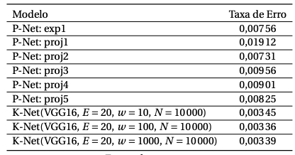
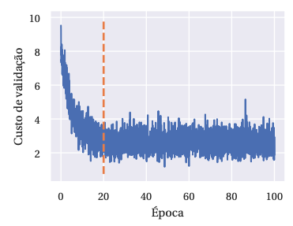
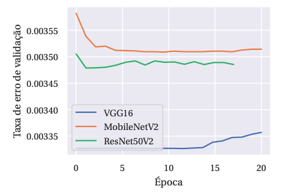
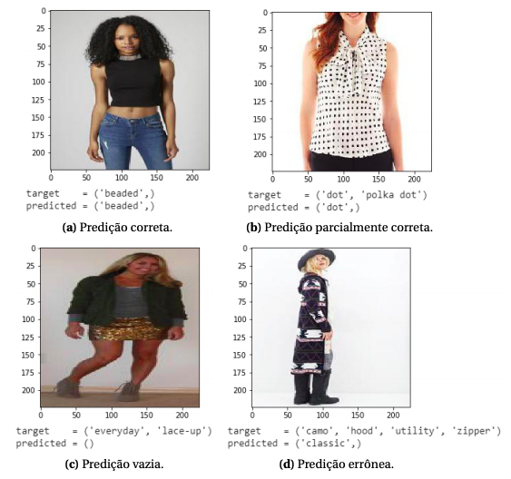

# CNNs  para a Classificação Multirrótulo de Peças de Roupa    

> Projeto desenvolvido colaborativamente com [Ruan Comelli](https://github.com/ruancomelli)

Mantendo em foco tanto a proposta de um classificador multi-label a nível próximo
ao estado-da-arte e ao mercado quanto o estudo estrutural do problema de classificação de
imagens com números elevados de possibilidade de atributos, o presente trabalho definiu
como objetivos principais:

1. P-Net: Construir uma rede neural convolucional utilizando uma parte do conjunto DeepFashion, empregando
mecanismos de atenção envolvendo landmarks (pontos limítrofes da peça de roupa)
para a categorização de classe (tipos de roupa como camiseta, calça e blusa) e atributos
(como azul, estampado e verão). 

2. K-Net: Expandir o mesmo trabalho, aplicado exclusivamente para a categorização de múltiplos atributos (excluindo a classificação e a detecção de landmarks), analisando diversos parâmetros de treino, bem como diferentes redes-base pré-treinadas no lugar da
VGG16, como a ResNet50V2 e a MobileNetV2.

Para otimizações e processamento de dados, bibliotecas como Scikit-learn (0.21.3),
Pandas (0.25.3) e Numpy (1.17.4) foram empregadas em ambos os códigos, todas elas em
suas versões mais recentes (02/12/2019) enquanto as redes foram construídas com as duas
bibliotecas líderes do mercado de redes neurais para deep learning.

A rede K-Net foi completamente desenvolvida utilizando a interface integrada
de desenvolvimento Google Colab utilizando funções e redes-base do Tensorflow 1.15.0 e
Keras 2.2.5.

Já a rede P-Net foi desenvolvida pela interface do Visual Studio Code 1.40.1 com a
biblioteca Pytorch 1.3.1 [26] para Cuda 10.1, contando com uma estrutura clássica de projetos
em Python - modularização de funções e variáveis em diversos arquivos com execução por
terminal de comandos Unix.

Resultados:

O relatório final entregue pode ser acessado pela pasta /docs, juntamente à proposta inicial.